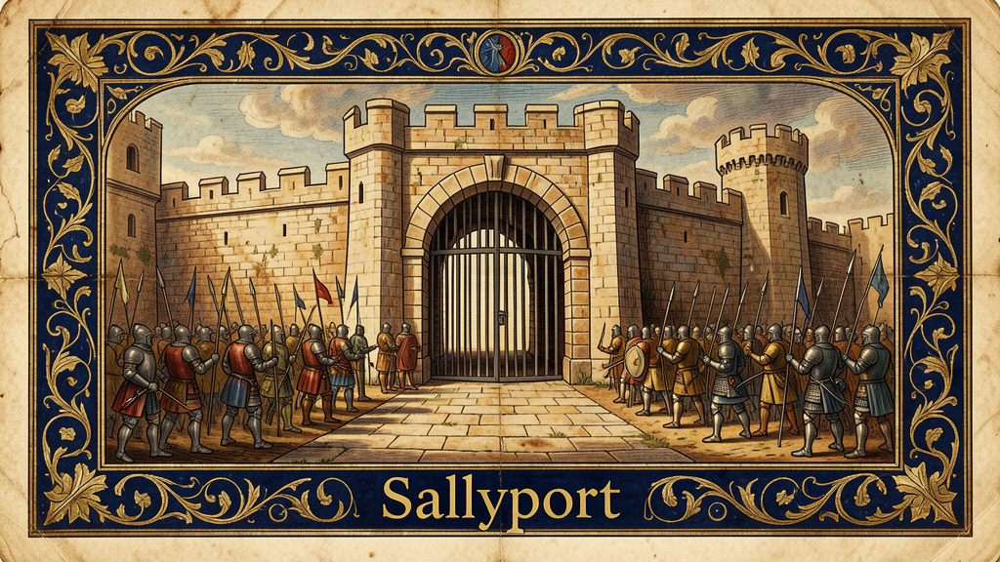

[](https://github.com/melxusgid/sallyport)

### Stealth browser REST API — drive a bot-proof browser with `curl`

[](https://python.org)
[](https://fastapi.tiangolo.com)
[](LICENSE)
[](https://hub.docker.com/r/fromthescope/sallyport)

[](https://github.com/tiliondev/fortress)
[](https://github.com/tiliondev/fortress)
[](https://github.com/tiliondev/fortress)
[](https://github.com/tiliondev/fortress)

[](#copy-for-agent)
[](llms.txt)

**Sallyport** wraps [Fortress](https://github.com/tiliondev/fortress) — a stealth Chromium engine with C++-level fingerprint spoofing — behind a REST API. Any agent, script, or human can browse the web through a bot-proof browser with simple HTTP calls.

No Playwright scripts. No CDP boilerplate. No anti-bot configuration.

> *A sallyport is a controlled passage through a fortress wall — the secure way in and out.*

## Why?

- **Bypasses anti-bot** — Fortress corrects canvas, WebGL, audio, fonts, navigator, and 30+ fingerprint surfaces inside Chromium's C++. CreepJS: 0%. Live Cloudflare Turnstile: cleared. Akamai Bot Manager: bypassed.
- **Agent-friendly** — REST API instead of Playwright. Any agent that speaks HTTP can browse.
- **Camofox-compatible** — Same endpoint pattern (`POST /tabs`, `GET /tabs/{id}/snapshot`).
- **Open source** — MIT license. Build on it, fork it, ship it.

## Known limits

Sallyport inherits some constraints from the upstream Fortress engine and its own architecture. These are surfaced here so you can decide when it's the right tool.

| Limit | Detail | Workaround |
|-------|--------|------------|
| **Cloudflare Turnstile Managed Challenge** | Fortress cannot bypass interactive Turnstile captchas (the checkbox/puzzle-wall variant). The snapshot returns a Cloudflare challenge page, not real content. | Use a residential proxy or try the URL via Wayback Machine / Google cache. This is a Fortress engine limitation. |
| **Datacenter IP blocking** | Servers that block datacenter IP ranges will reject requests regardless of browser fingerprint. | Use a residential proxy via the engine's proxy config (planned). |
| **Single browser instance** | Only one Fortress instance at a time. Switching personas requires stop/start. | N/A — architectural limit tracked for v0.2.0. |
| **No crash recovery** | If Fortress crashes mid-session, the engine enters a broken state. Manual stop/start required. | Tracked for v0.2.0. |
| **No concurrent request locks** | Shared mutable state (tabs, browser ref) has no threading locks. Unlikely to race on single-user setups. | Tracked for v0.2.0. |
| **No cookie/session persistence** | Each tab opens a fresh context. Auth sessions are lost on tab close. | Tracked for v0.2.0. |

[Full issue tracker →](ISSUES.md)

## Benchmarks

Measured on a Mac Mini (Apple M-series, ARM64) with Sallyport v0.1.0 + Fortress stable:

| Operation | Median | Worst case |
|-----------|--------|------------|
| Open tab | 1.43s | 3.07s |
| Snapshot (simple page) | 5.2ms | 43.6ms |
| Snapshot (heavy page) | 65.6ms | 187.8ms |
| JS evaluate | 3.8ms | 51.4ms |
| Scroll | 14.7ms | 22.0ms |
| Screenshot | 47.9ms | 97.7ms |

[Full benchmark methodology and raw data →](BENCHMARKS.md)

## Quick start

### Docker

```bash
docker run -d --rm --platform linux/amd64 --shm-size=1g -p 9378:9378 fromthescope/sallyport:latest
```

### Local

```bash
pip install sallyport
python3 -m sallyport.server
```

Then:

```bash
# Start the stealth browser engine
curl -X POST http://localhost:9378/browser/start \
  -H "Content-Type: application/json" \
  -d '{"channel":"stable"}'

# Open a page — even Cloudflare/Akamai protected ones
curl -s -X POST http://localhost:9378/tabs \
  -H "Content-Type: application/json" \
  -d '{"url":"https://bot.sannysoft.com","wait_ms":4000}' \
  | python3 -c "import json,sys; d=json.load(sys.stdin); print(d['snapshot'][:500])"

# Close up
curl -X DELETE "http://localhost:9378/tabs/<tab_id>"
curl -X POST http://localhost:9378/browser/stop
```

## API

| Method | Endpoint | Description |
|---|---|---|
| `GET` | `/health` | Server status, tab count, uptime |
| `GET` | `/config` | Server config and feature flag state |
| `POST` | `/browser/start` | Launch Fortress with optional persona |
| `POST` | `/browser/stop` | Kill Fortress, clean up all tabs |
| `POST` | `/tabs` | Open URL → tab ID + snapshot |
| `GET` | `/tabs/{id}/snapshot` | Accessibility tree content |
| `GET` | `/tabs` | List all open tabs with URL, age |
| `GET` | `/tabs/{id}/source` | Raw rendered HTML (full DOM after JS) |
| `POST` | `/tabs/{id}/scroll` | Scroll up/down/left/right by px |
| `POST` | `/tabs/{id}/screenshot` | Base64 PNG screenshot (supports full_page) |
| `POST` | `/tabs/{id}/click` | Click element by ref |
| `POST` | `/tabs/{id}/type` | Type text into element |
| `POST` | `/tabs/{id}/evaluate` | Run JS, get result |
| `POST` | `/tabs/{id}/navigate` | Navigate existing tab |
| `DELETE` | `/tabs/{id}` | Close tab |

### Example: persona override

```bash
# Start with a specific browser persona
curl -X POST http://localhost:9378/browser/start \
  -H "Content-Type: application/json" \
  -d '{
    "channel":"stable",
    "persona": {
      "timezone":"America/New_York",
      "languages":"en-US,en",
      "hw_concurrency":16,
      "screen_width":1920,
      "screen_height":1080
    }
  }'
```

## Architecture

```
Agent/Hermes ──curl──> Sallyport (:9378) ──CDP──> Fortress (:9222)
                              │
                              └── Playwright drives CDP, FastAPI wraps it
```

| Layer | What | Who |
|---|---|---|
| Engine | Chromium C++ fingerprint patches (34 patches) | [tiliondev/fortress](https://github.com/tiliondev/fortress) |
| SDK | Python package to download & launch Fortress | tiliondev (upstream) |
| REST API | FastAPI + Playwright CDP session management | **Sallyport** (this project) |
| Agent skill | Hermes skill for curl-based browsing | **Sallyport** |

## How it compares

| | Stock Playwright | puppeteer-stealth | Camoufox | **Sallyport + Fortress** |
|---|---|---|---|---|
| Spoof layer | none | JS injection | C++ (Firefox) | **C++ (Chromium)** |
| `toString` yields `[native code]` | n/a | ❌ | ✅ | ✅ |
| Survives iframe/worker | ❌ | ❌ | ✅ | ✅ |
| Engine | Chromium | Chromium | Firefox | **Chromium** |
| TLS shape | Chromium | Chromium | Firefox (sticks out) | **Chromium** |
| Agent-friendly REST API | ❌ | ❌ | ❌ (Camofox adds it) | **✅ built in** |
| Open source | ✅ | ✅ | ✅ (MPL) | **✅ (MIT)** |
| **Worst case**<br>Cloudflare Turnstile Managed Challenge | blocked | blocked | blocked | **blocked** (Fortress limitation) |
| **Worst case**<br>Tab open latency | 0.8–1.5s | 0.8–1.5s | 1.0–2.0s | **1.1–3.1s** (measured, includes CDP setup) |

Worst-case numbers are from [published benchmarks](BENCHMARKS.md). We measured the case that matters most: opening a new tab and getting content. Stock Playwright numbers are from the same hardware for reference.

## Environment

| Variable | Default | Description |
|---|---|---|
| `SALLYPORT_HOST` | `0.0.0.0` | Server bind address |
| `SALLYPORT_PORT` | `9378` | Server port |
| `FORT_CHANNEL` | `stable` | `stable` (Chromium 149) or `latest` (151) |
| `FORT_PORT` | `9222` | Fortress CDP port |

## Feature flags (kill switches)

Every capability can be disabled at startup via environment variable. These let operators minimize surface area when running Sallyport in restricted environments.

| Variable | Default | Effect when set to `true` |
|---|---|---|
| `SALLYPORT_DISABLE_SNAPSHOT` | (empty) | Blocks all AX tree snapshot endpoints. Tab opens return empty snapshots. |
| `SALLYPORT_DISABLE_AUTO_SNAPSHOT` | (empty) | `POST /tabs` returns only `tab_id` + `url` (no snapshot inline). Useful for head-of-line blocking avoidance. |
| `SALLYPORT_DISABLE_JS_EVAL` | (empty) | Blocks `POST /tabs/{id}/evaluate`. |
| `SALLYPORT_DISABLE_SCREENSHOT` | (empty) | Blocks `POST /tabs/{id}/screenshot`. |
| `SALLYPORT_DISABLE_SOURCE` | (empty) | Blocks `GET /tabs/{id}/source`. |
| `SALLYPORT_DISABLE_ACTIONS` | (empty) | Blocks click, type, and scroll endpoints. |

Disabling a feature makes its endpoints return HTTP 503 with the env var name in the error detail.

Check current flags at runtime:
```bash
curl http://localhost:9378/config
```

## Copy for agent

```
Sallyport is a REST API wrapper around Fortress, an open-source stealth Chromium engine.
It exposes HTTP endpoints so any agent can browse anti-bot-protected sites with curl.

LAUNCH:
  docker run -d --rm --platform linux/amd64 --shm-size=1g -p 9378:9378 fromthescope/sallyport:latest
  curl -X POST http://localhost:9378/browser/start -H "Content-Type: application/json" -d '{}'
  curl -X POST http://localhost:9378/tabs -H "Content-Type: application/json" -d '{"url":"<URL>","wait_ms":3000}'

CONNECT:
  Use the returned tab_id to interact: snapshot, click, type, evaluate.
  curl http://localhost:9378/tabs/{tab_id}/snapshot

RULES:
  1) Do NOT add puppeteer-stealth or JS stealth plugins — Fortress does this in C++.
  2) Do NOT use chromedriver — connect over CDP.
  3) Blocked 90% of the time = IP issue (datacenter), not fingerprint. Use residential proxy.

Full guide: https://github.com/melxusgid/sallyport
```

## License

MIT. The upstream Fortress engine is BSD-3.

---

*Built by [FromTheScope](https://buymeacoffee.com/fromthescope). If Sallyport saves you time or money, [coffee's appreciated ☕](https://buymeacoffee.com/fromthescope).*
